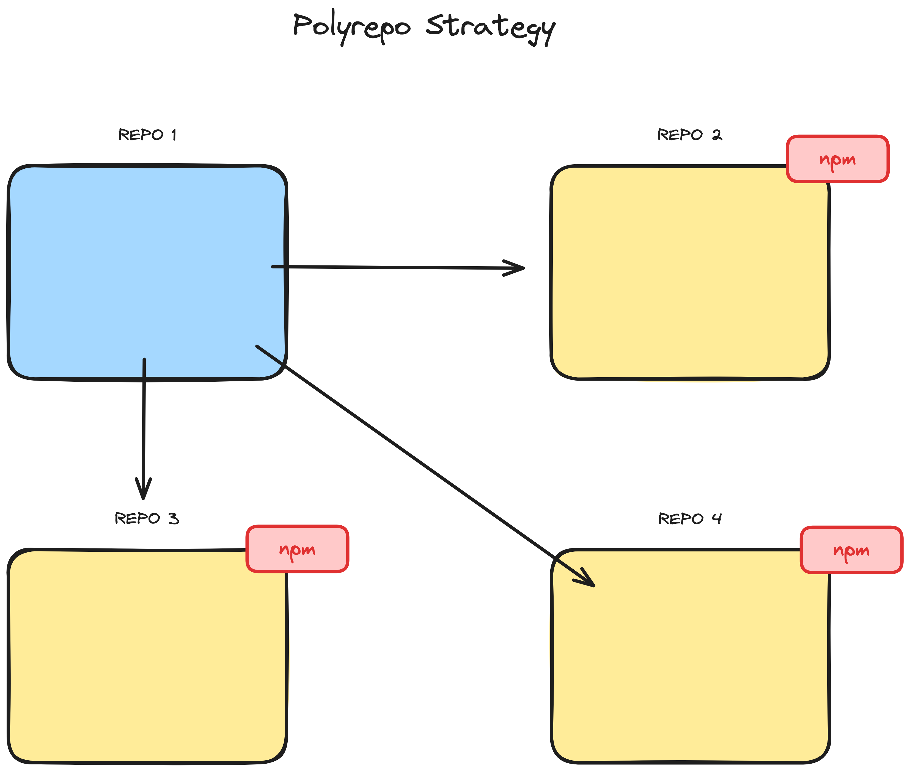

## Understanding Monorepos

## Scaling a Codebase

When it comes to scaling a codebase, companies face a crucial decision. They can either break their codebase into smaller, separate repositories (a strategy known as polyrepo), or they can consolidate their codebase into a single repository (a strategy known as monorepo).

## Polyrepo Strategy

In a polyrepo approach, each application or service is maintained in its own separate repository. For instance, your main application would reside in one repository, while any shared services or libraries it uses, such as authentication or design systems, are stored in their respective repositories. These shared components are typically published to a package manager like NPM, allowing them to be easily included and updated across various projects.

> In simple terms, a polyrepo approach means using a separate repository for each team, application, or project, with each one having its own build process.

## Monorepo Strategy

A monorepo is a single repository that houses the code for multiple projects. These projects are distinct yet interconnected, and they often include related JavaScript or TypeScript packages. The projects within a monorepo can range from low-level utilities to high-level web user interfaces.

> The only difference is where you put your code. It’s probably a good idea to organize your code into small independent and self-contained components with well-defined boundaries and interfaces.

## Monorepo vs Monolith Clarified

A common misconception is that a monorepo and a monolithic application are the same. However, they differ significantly in structure. A monolithic application is essentially one large codebase that encompasses all its projects and components. On the other hand, a monorepo serves as a single repository that contains multiple, independent projects. This setup supports a modular approach to development, allowing each project to be developed separately yet still under the umbrella of a single version control system.
